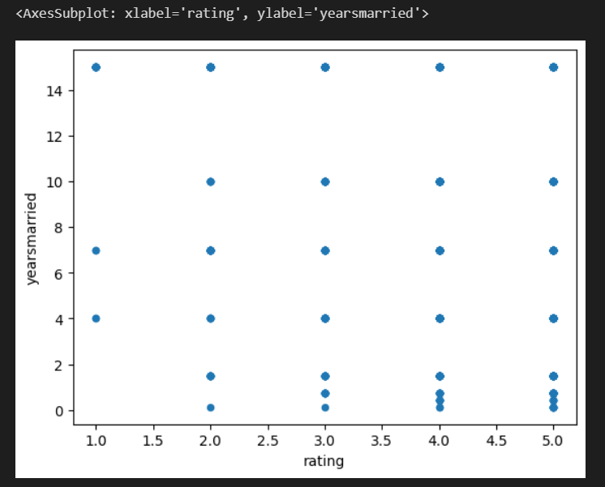
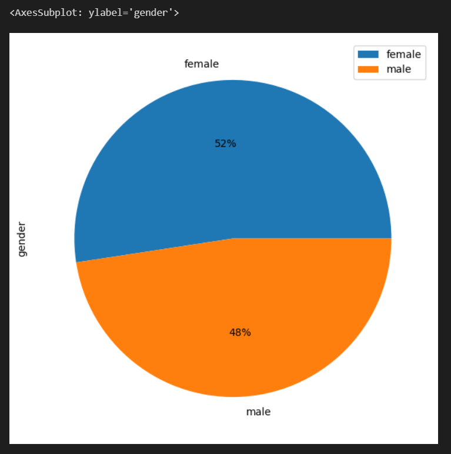
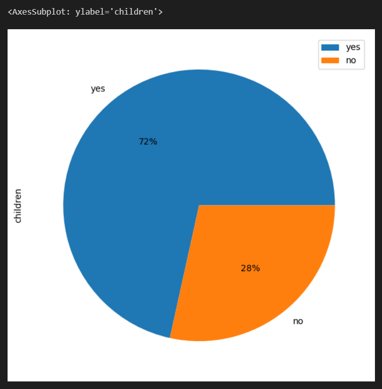
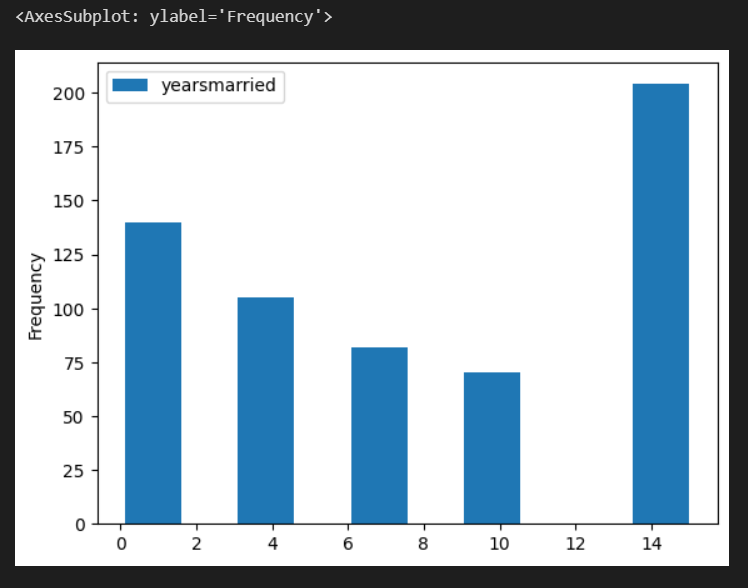
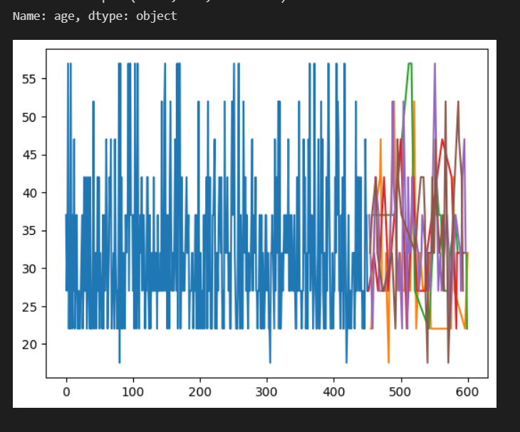

# Affairs-Data-Explirations

## Table of Contents

- [Dataset](#Dataset-)
- [Overview](#Overview)
- [Data Dictionary](#Data-Dictionary-)
- [Visualize](#Visualize)

# Dataset :

This is a collection of historical data on the statistics of a real estate company, spanning from 2003 to 2010. It includes information about the employees and their activities.

## Overview

the affairs dataset contains detailed information about employees, including their affairs, gender, age, years married	children, religiousness, education, occupation and rating.

|            | affairs | gender | age | yearsmarried | children | religiousness | education | occupation | rating |
|------------|---------|--------|-----|--------------|----------|---------------|-----------|------------|--------|
| 0          | 4       | male   | 37.0| 10.00        | no       | 3             | 18        | 7          | 4      |
| 1          | 5       | female | 27.0| 4.00         | no       | 4             | 14        | 6          | 4      |
| 2          | 11      | female | 32.0| 15.00        | yes      | 1             | 12        | 1          | 4      |
| 3          | 16      | male   | 57.0| 15.00        | yes      | 5             | 18        | 6          | 5      |
| 4          | 23      | male   | 22.0| 0.75         | no       | 2             | 17        | 6          | 3      |
| ...        | ...     | ...    | ... | ...          | ...      | ...           | ...       | ...        | ...    |
| 596        | 1938    | male   | 22.0| 1.50         | yes      | 1             | 12        | 2          | 5      |
| 597        | 1941    | female | 32.0| 10.00        | yes      | 2             | 18        | 5          | 4      |
| 598        | 1954    | male   | 32.0| 10.00        | yes      | 2             | 17        | 6          | 5      |
| 599        | 1959    | male   | 22.0| 7.00         | yes      | 3             | 18        | 6          | 2      |
| 600        | 9010    | female | 32.0| 15.00        | yes      | 3             | 14        | 1          | 5      |

  ## Data Dictionary : 

| Column         | Description                                              |
|----------------|----------------------------------------------------------|
| affairs        | Level of involvement in extramarital affairs.            |
| gender         | Gender of the employee.                                  |
| age            | Age of the employee.                                     |
| yearsmarried   | Number of years married.                                 |
| children       | Indicates whether the employee has children.             |
| religiousness  | Level of religiousness.                                  |
| education      | Educational level of the employee.                       |
| occupation     | Occupation of the employee.                              |
| rating         | Rating or satisfaction score provided by the employee.   |

## Visualize

1. Curve of rating by years of marriage

2.Data frame gender percentage

3. Data frame is has children percentage

4.Statistical rating table by years of marriage

5.Curve of affairs by age   

